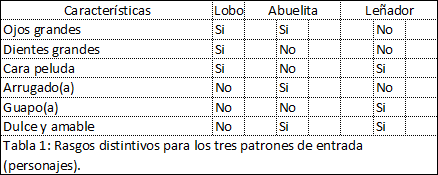
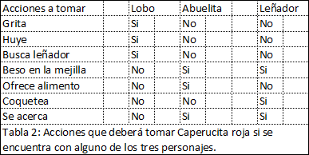

# PerceptronMulticapa
Utilización de un Perceptrón Multicapa para resolver el problema de la Caperucita Roja.

Se resuelve con el perceptrón multinivel el problema que tuvo caperucita roja en el bosque. Caperucita tenía la misión de llevar el almuerzo a la abuelita que vivía al otro lado del bosque. En el camino, ella debía reconocer y actuar acertadamente al encontrarse con el lobo, con el leñador o con su abuelita.

La tabla 1 muestra seis características que pueden distinguir al lobo, a la abuelita y al leñador. La tabla 2 muestra siete acciones que Caperucita puede tomar, dependiendo de quien haya reconocido.

El perceptrón multinivel tendrá tres posibles patrones de entrada: uno para el lobo, otro para la abuelita y el tercero para el leñador. Cada vector de entrada tiene seis posiciones, en las cuales 1 representa "Si" y 0 representa "No". Cada vector de entrada tiene su correspondiente vector de salida, usando la misma codificación.

Por ejemplo, para el primer patrón (lobo) tenemos que la entrada está dada por el vector (1, 1, 1, 0, 0, 0) y el de salida es (1, 1, 1, 0, 0, 0, 0).

